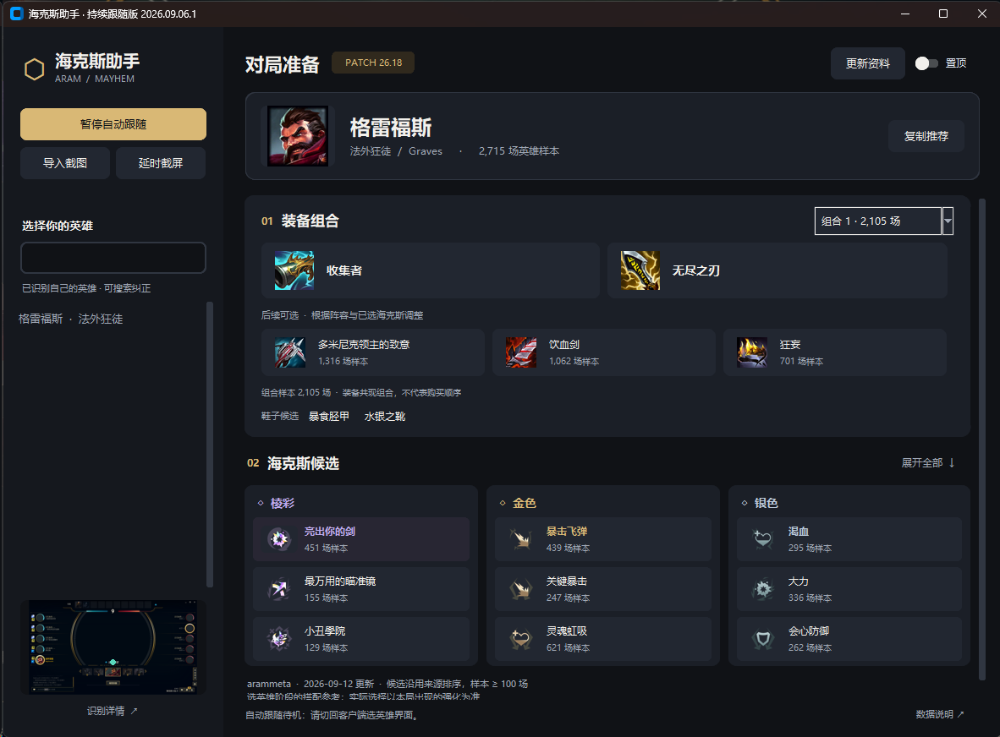

# 海克斯大乱斗助手

实时根据版本数据更新符文和装备推荐，每次启动都会默认更新资料库。个人用了一段时间没被封号

## 界面


- 左侧集中放置自动识别、截图导入和英雄搜索；`Ctrl+F` 聚焦搜索框。
- 顶部显示英雄头像与样本量；装备图标、核心组合和后续可选分区显示。
- 海克斯按棱彩、金色、银色分栏，每栏默认展示 3 个候选，点击“展开全部”可查看最多 5 个。
- 组合选择框切换来源中的真实装备组合。“复制推荐”仍复制完整文字，包括未在卡片中展开的候选和数据说明。
- 版本号与更新日期保留在摘要里；完整来源、样本说明和详情通过底部“数据说明”打开。
- 图标按需从 Riot Data Dragon 与 arammeta 下载到 `.cache/icons/`；失败时保留名称，不影响推荐。截图始终不上传。
- 默认 1180×840，最小 1020×700；主内容可垂直滚动，支持窗口缩小后的查看。

## 启动

### 单文件 EXE

双击 `dist/海克斯助手.exe` 即可启动。只需要这一个文件，不需要安装 Python，也不需要携带模型或依赖文件夹。

EXE 内含 Python、桌面组件、OCR 模型、英雄目录、打包时的完整推荐快照与图标。运行时会自动解压到系统临时目录，正常退出后清理，因此首次启动需要稍等。版本检查与后续推荐更新仍需联网；内置资料也遵循原有的过期检查。

EXE 的持久缓存写入 `%LOCALAPPDATA%\Hexassist\cache`，不会写入 EXE 所在目录。源码运行时仍使用项目的 `.cache/`。

### 从源码启动

Windows / Python 3.10–3.13；本项目在 Windows + Python 3.13 下验证。

首次安装：

```powershell
python -m venv .venv
.\.venv\Scripts\python.exe -m pip install -r requirements.txt
.\.venv\Scripts\python.exe app.py
```

依赖安装后可以直接双击 `run.bat`。本工作区已安装依赖。OCR 使用本地模型，推荐资料在启动时联网检查，无需 API Key；成功下载后可使用未过期的本地缓存。

## 使用

1. 点击 **导入截图**，选择完整客户端选英雄界面图片；可用 `examples/selection_demo.png` 先体验（明确标注的合成图）。
2. 或点击 **延时截屏**：助手会暂时隐藏，三秒内切回客户端选英雄界面；直接截取客户端内容区域，无需选择显示器。
3. 启动后自动开始跟随选英雄界面：每 0.5 秒检查前台客户端，持续识别中央立绘下方自己的英雄名称。换英雄后自动切换推荐；相同英雄不重置已选出装组合，切换动画或暂时切出客户端时保留上一结果。每局结束后持续待机，下一局选英雄时自动继续。仅点击 **暂停自动跟随** 才会主动停止。
4. 检测到 `League of Legends.exe` 游戏进程启动（进入加载/游戏）后，处理完最后一张待识别截图后暂时保留英雄、截图与推荐，后台线程继续待机。客户端再次可见时自动继续获取，即使旧游戏进程尚未退出。手动搜索不会关闭跟随；希望固定手动英雄时可明确暂停。
5. 右侧查看推荐的版本、快照日期和样本量，下拉框切换该英雄的真实装备组合；可以复制文本或打开数据来源。
6. 每次启动都在后台联网更新推荐资料，顶部显示更新中、已在线更新或更新失败。**更新资料** 可随时重试；装备详情按当前英雄获取，始终绑定最新快照的同一提交。网络失败时保留缓存并明确提示失败，不冒充更新成功。

截图只在内存中处理，不上传、不自动落盘。自动识别与延时截图读取前台 `LeagueClientUx.exe` / `LeagueClient.exe` 客户端窗口的可见内容；无游戏内存读取、注入、购买或按键操作。 是否进入游戏通过系统进程列表中的可执行文件名判断；不会把普通切窗误判为进入游戏。

## 推荐数据的含义

- “符文”在首版中指 **局内海克斯强化符文**，不是召唤师峡谷赛前符文页。
- 选英雄阶段还没有本局强化选项，首版展示开局规划用的方向和候选，不做局内三选一识别。
- 推荐来源改为 [arammeta](https://arammeta.com/about/) 的海克斯大乱斗逐英雄社区统计。该站由 LCU 收集样本，不是 Riot 官方统计，也不能当作国服全量结论。
- 2026-09-05 接入时，源快照为 **26.17 / 2026-09-04**，含 **173 位英雄、209 个海克斯**。后续以界面实际显示的快照为准。
- 按来源的逐英雄排序提供棱彩、金色、银色候选，过滤英雄×海克斯少于 100 场的条目。程序展示样本量，不展示海克斯胜率。
- 出装展示来源的核心装备共现组合及同组合下的可选装备，**共现不是购买顺序，也不要求把所有可选装备装在一起**。
- 未取得足够数据时显示缺失；不再用职业通用出装代替。旧数据仅保存在 `data/archive/recommendations-prototype.json`，程序不会读取。
- 装备中文名优先使用本地 Riot Data Dragon，海克斯名使用来源提供的国服名称字典；部分名称和效果描述仍保留繁中。来源的名称字典标记为 `16.13.1`，它只用于名称映射，**不导入旧字典的装备属性和效果描述**；效果描述取自本次推荐快照，数值可能被来源省略。
- 海克斯模式的特殊装备不会再被普通大乱斗的可购买标记错误过滤；实际合成、强化授予和鞋子升级条件仍以局内为准。
- 暂不根据本局阵容、已选海克斯或三选一选项重新排序。

## 版本与缓存规则

- 每次启动或点击更新时，查询 Data Dragon 最新资料版本和 arammeta 最新发布提交。
- 索引、名称映射和英雄详情绑定同一个不可变 Git 提交；本地缓存位于 `.cache/arammeta/`，未纳入版本管理。
- 推荐快照版本与已检测到的资料版本不一致、源快照日期超过 7 天、或超过 7 天未联网检查版本时，暂停显示推荐。
- 下载失败保留旧快照和原检查时间，界面明确显示失败，不把本次下载时间当作数据更新时间。离线缓存只能说明上次核对时的版本，不能证明当前地区服没有热修。
- Data Dragon 的 `16.17` 和该快照展示的游戏版本 `26.17` 属于不同编号体系；程序使用源数据里的编号字段，不靠下载日期猜测版本。

## 识别范围与限制

- 选英雄 OCR 匹配中央当前皮肤名称、英雄名或称号，需明确且唯一匹配，置信度至少 0.65。当前英雄目录含 173 位。
- 无法唯一对应英雄的皮肤名、冲突结果或模糊匹配不自动展示推荐；可以手动搜索纠正。
- 识别区域依据当前 16:9 客户端布局按比例缩放，自动截取客户端内容；导入截图需裁去桌面和窗口外框，保留完整客户端画面。不同客户端布局、文字遮挡、特殊缩放或低清图仍可能漏识别。
- 中央皮肤标题区域单独放大识别，队友、玩家昵称、聊天和插件区域不参与匹配。未读到自己的英雄时继续等待，原始 OCR 文字可用于诊断。
- 独占全屏可能截图黑屏，可用无边框窗口或手动导入已有截图。置顶窗口不保证覆盖独占全屏。
- 已验证用户提供的佐伊和卡特琳娜两张选英雄截图及其 1920×1080、1600×900、1280×720 版本：每张只识别自己的一个英雄；尚未验证不同布局的实战覆盖率。

## 更新和扩展

更新英雄、皮肤和装备资料（联网，需要下载每位英雄的皮肤名称）：

```powershell
.\.venv\Scripts\python.exe scripts/update_data.py
# 也可指定 Data Dragon 版本：
.\.venv\Scripts\python.exe scripts/update_data.py 16.17.1
```

上述脚本只更新识别用名称和静态装备目录。昵称在 `data/aliases.json` 中维护。

推荐资料可在桌面中点击“更新资料”，也可以用命令行更新并预缓存常玩英雄的装备详情：

```powershell
.\.venv\Scripts\python.exe scripts/update_recommendations.py Jinx Garen Yasuo
```

主要模块：

| 文件 | 用途 |
| --- | --- |
| `app.py` / `hexassist/gui.py` | 桌面窗口、后台任务、确认英雄与交互 |
| `hexassist/dashboard.py` | 主题、卡片排版、英雄列表和图标缓存 |
| `hexassist/capture.py` | 截屏与前台游戏窗口定位 |
| `hexassist/recognition.py` | OCR、别名匹配、选英雄标题区域定位 |
| `hexassist/catalog.py` | 本地英雄与装备资料 |
| `hexassist/live_data.py` | 来源适配、不可变快照、版本检查、缓存 |
| `hexassist/recommendation.py` | 展示逐英雄样本与装备组合 |
| `scripts/update_recommendations.py` | 推荐资料更新与指定英雄预缓存 |

后续重点：更多客户端布局与选英雄截图校准、国服逐词条核验、已选海克斯与装备联动、局内三选一截图输入。

## 重新打包

在 Windows 64 位环境运行 `build.bat`，或执行：

```powershell
.\.venv\Scripts\python.exe -m pip install -r requirements-build.txt
.\.venv\Scripts\python.exe scripts/prepare_bundle.py
.\.venv\Scripts\python.exe -m PyInstaller --noconfirm Hexassist.spec
```

产物为 `dist/海克斯助手.exe`。`build_assets/` 和 `build/` 是构建中间目录，不需要发给使用者。构建脚本预取全英雄装备详情，内置资源保持只读；后续联网更新保存在用户目录。

EXE 支持独立自检：`海克斯助手.exe --self-test <报告文件绝对路径>`。自检核对内置全英雄详情、桌面组件、真实 OCR 模型识别和缓存可写性；会生成 JSON 报告并退出。
可追加 `--self-test-image <选英雄截图绝对路径>` 验证实际截图，报告包含识别英雄 ID 和选英雄布局判断。截图作为外部测试输入，不打入 EXE。

## 验证

```powershell
.\.venv\Scripts\python.exe -m unittest discover -s tests -v
# 包含真实 OCR 模型的集成测试（使用合成图，不是游戏实测）：
$env:HEXASSIST_TEST_OCR = '1'
.\.venv\Scripts\python.exe -m unittest discover -s tests -v
```

测试覆盖名字匹配、低置信度过滤、加载布局、过期与版本不匹配拦截、更新失败保留旧日期、跨快照缓存隔离、特殊装备保留、低样本过滤和真实装备组合切换。数据层单元测试使用合成数据，不依赖实时网络；真实来源另行联网验证。合成图生成器需要 Windows 微软雅黑字体。

2026-09-05 的真实加载截图回归覆盖赵信、卡莎、腕豪、凯尔、薇恩、辛吉德、阿卡丽、库奇、安蓓萨、厄运小姐。设置 `HEXASSIST_TEST_IMAGE` 为该截图的本地路径，可在上述 OCR 测试中同时验证原始 2560×1440 与 1920×1080 版本；未提供时跳过这项测试。此结果仅覆盖该样本，仍需扩充不同皮肤和显示设置的真实样本。

## 资料来源

- [Riot Data Dragon 文档](https://developer.riotgames.com/docs/lol#data-dragon)：英雄、皮肤及装备静态资料，不提供本项目推荐排序。
- [arammeta 方法说明](https://arammeta.com/about/) 和 [源项目](https://github.com/Lanternko/ARAM-Mayhem-Database)：当前推荐快照、样本量与装备组合，源 README 标注 MIT。
- [RapidOCR](https://github.com/RapidAI/RapidOCR)：本地 OCR。

Hexassist is not endorsed by Riot Games and does not reflect the views or opinions of Riot Games or anyone officially involved in producing or managing Riot Games properties. Riot Games and all associated properties are trademarks or registered trademarks of Riot Games, Inc.

选英雄截图回归测试：设置 `HEXASSIST_TEST_OCR=1`、`HEXASSIST_TEST_SELECTION_IMAGE` 为佐伊队伍截图路径、`HEXASSIST_TEST_SOLO_IMAGE` 为卡特琳娜单人截图路径。两张分别只输出佐伊与卡特琳娜；真实图片不纳入 EXE。旧加载图测试仅保留作为底层 OCR 回归。

自动跟随与启动测试覆盖：英雄替换、同英雄保留组合、空白帧保留结果、游戏启动前最后帧处理、锁定后旧事件丢弃、每次启动触发联网更新、缓存未变化时仍在线检查。2026-09-05 再次在线核对并内置了当天的 26.17 推荐快照。

2026.09.06.1 持续跟随修复：游戏进程存在时不再永久结束线程；第二次及后续进入客户端自动恢复。截图或 OCR 临时错误自动重试，导入图片/延时截图完成后恢复原有跟随状态。标题栏显示版本号以便区分旧 EXE。独立 EXE 自检还模拟连续三轮进入与离开游戏并执行真实 OCR。
